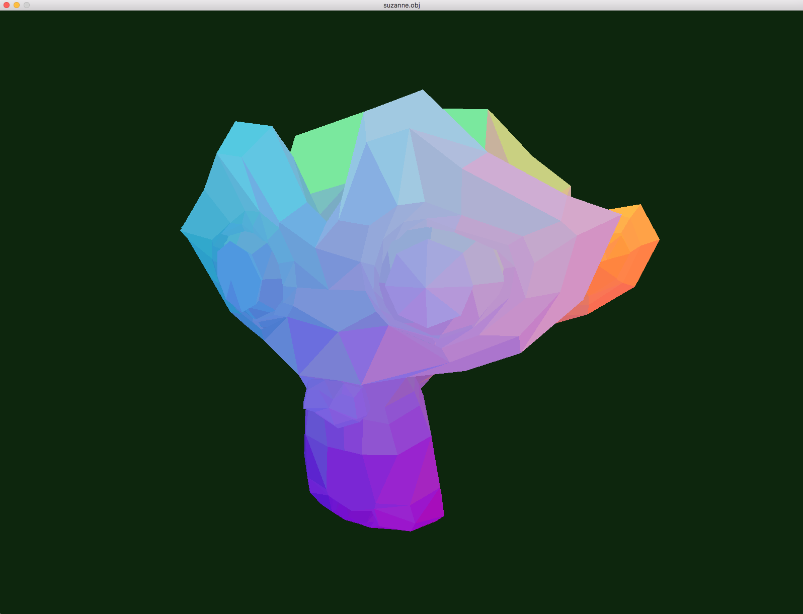
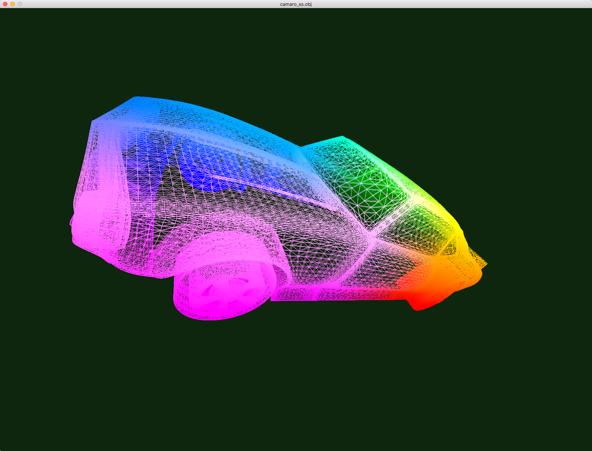
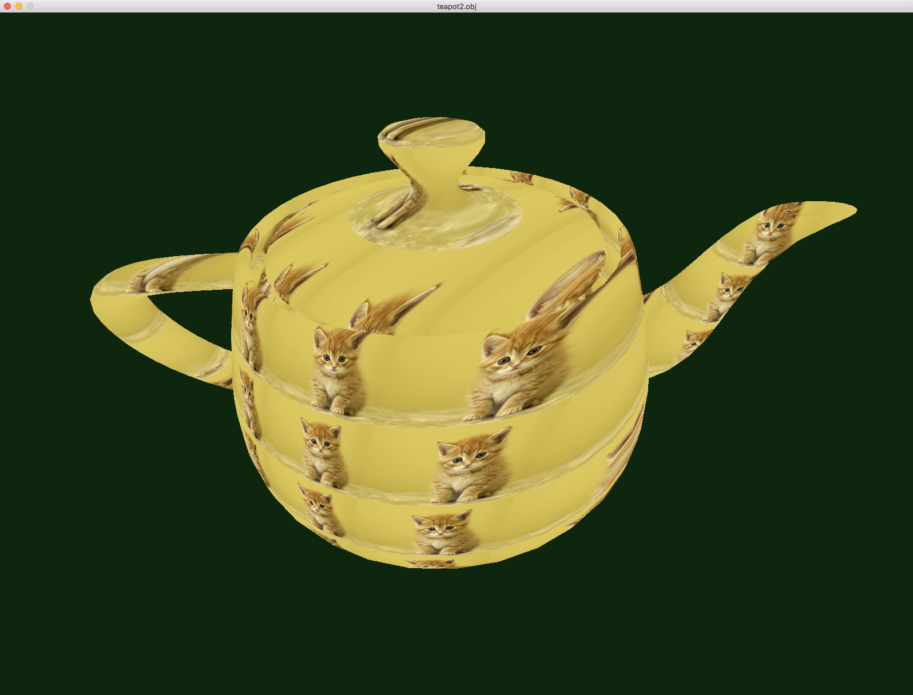

# Scop

As an introduction to the use of OpenGL, this program displays the 3D object file provided in argument with perspective.
Note that no library was allowed to parse/load the model.
You can find some models in the `ressources` folder.

## Usage

```
./scop [.obj file]
```

## Controls

`w` `a` `s` `d` `q` `e`: move the model
`arrow keys` `page up` `page down`: rotate the model
`+` `-`: increase/decrease ambient lightning
`space`: reset display
`1`: automatic rotation on/off
`2`: wireframe display
`3`: interpolation on/off
`4`: colors/greyscale
`5`: gradient/yolo coloring
`6`: texture on/off



